# Altar Gallery

Multimedia content delivery platform

This project is my study's engineering work.

## Screens

Full view | Media details | SPA mock design
---|---|---
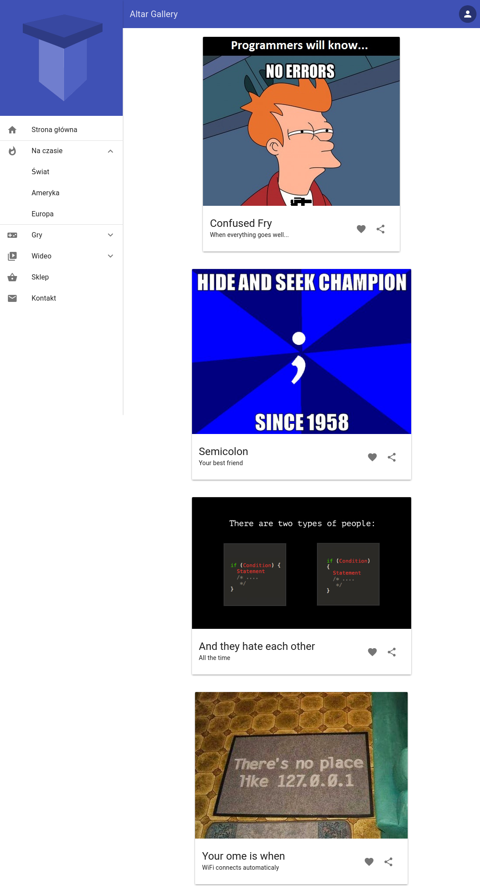 | 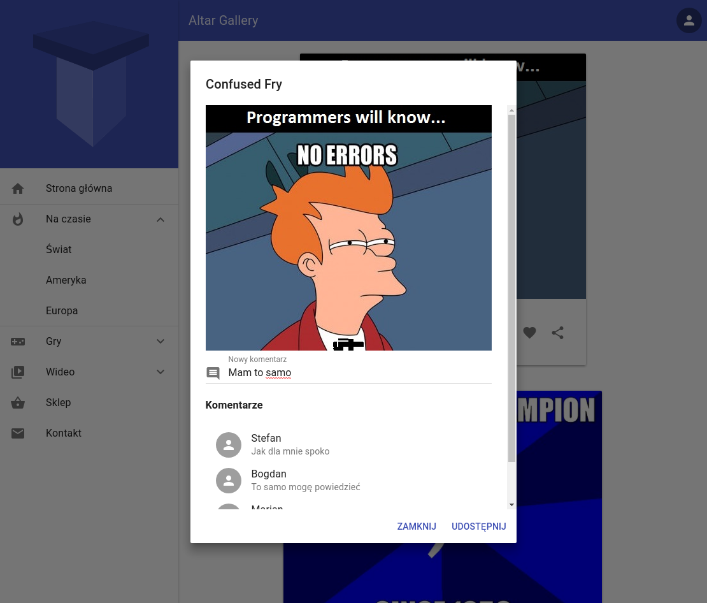 | 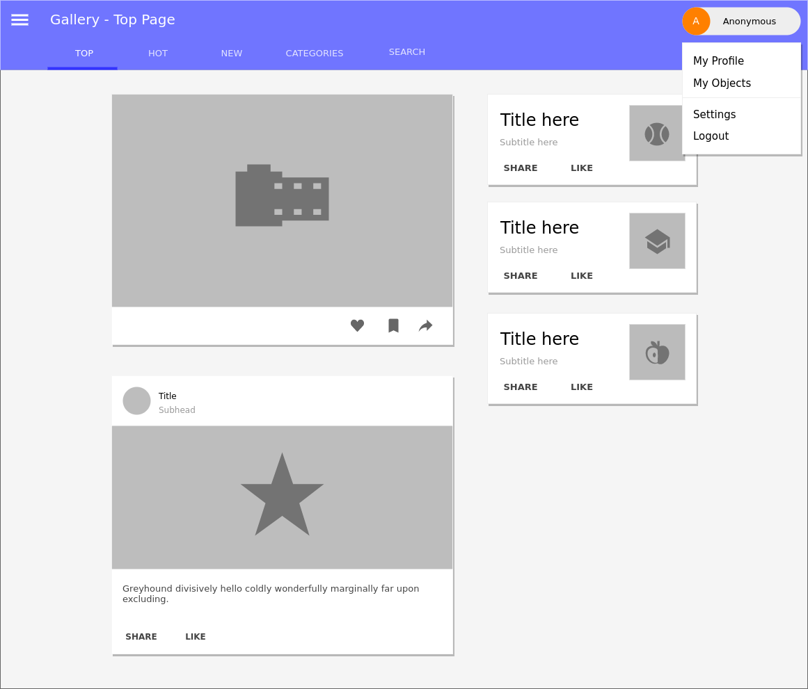

Mobile app | Mobile app mock 1 | Mobile app mock 2
---|---|---
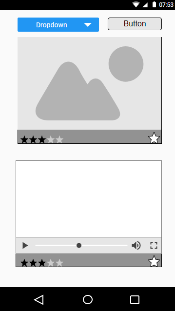 | 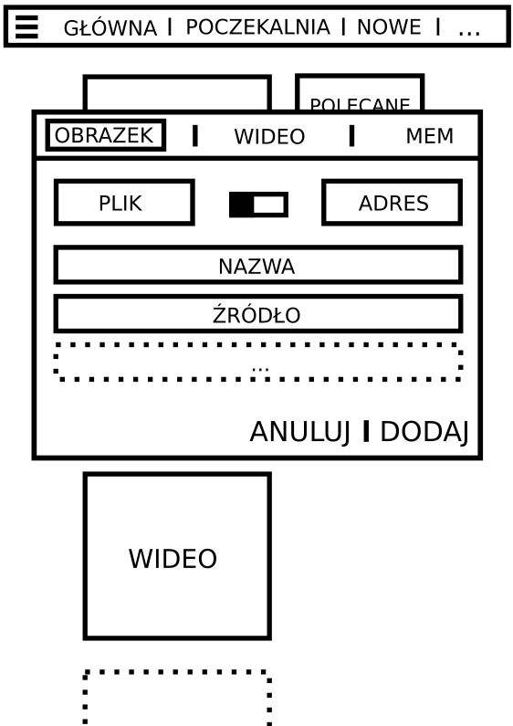 | 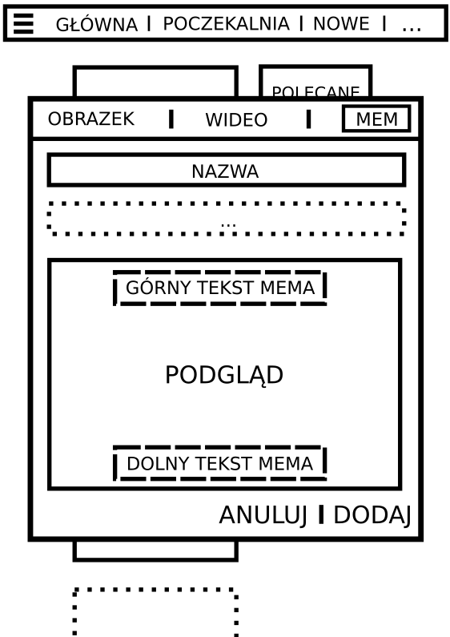

Architecture | Rest API | Diagram DFD
---|---|---
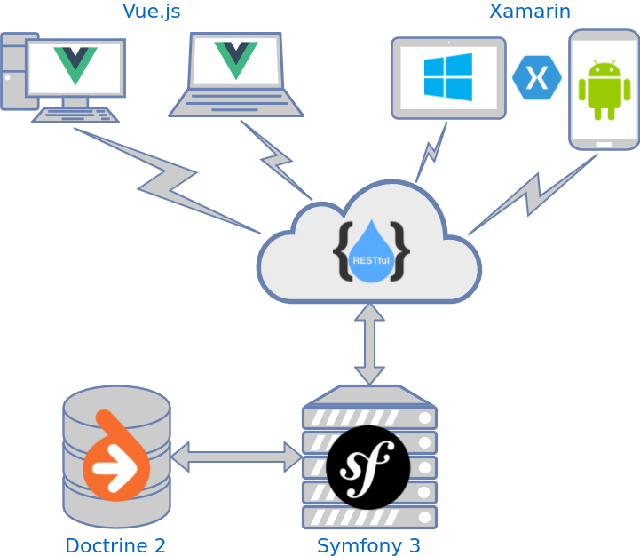 | 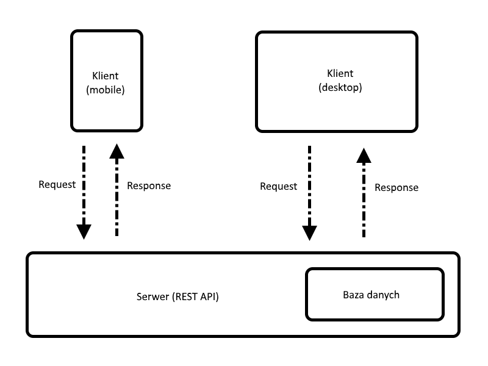 | 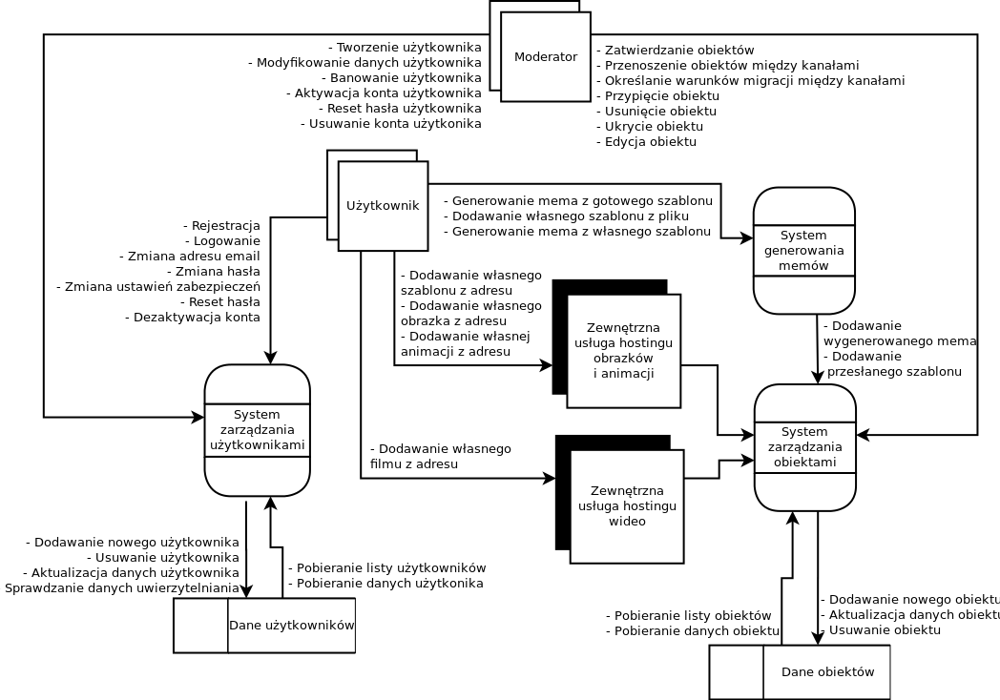

Database diagram | Adding object process | Function diagram
---|---|---
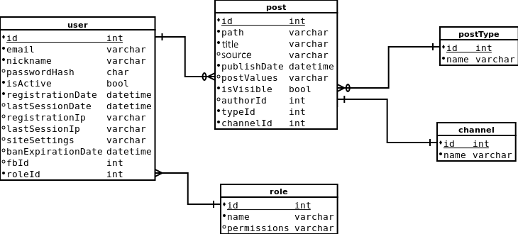 | 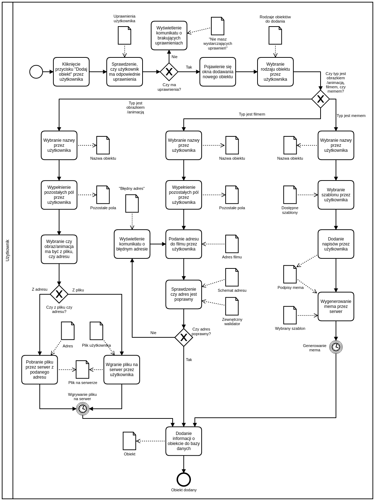 | 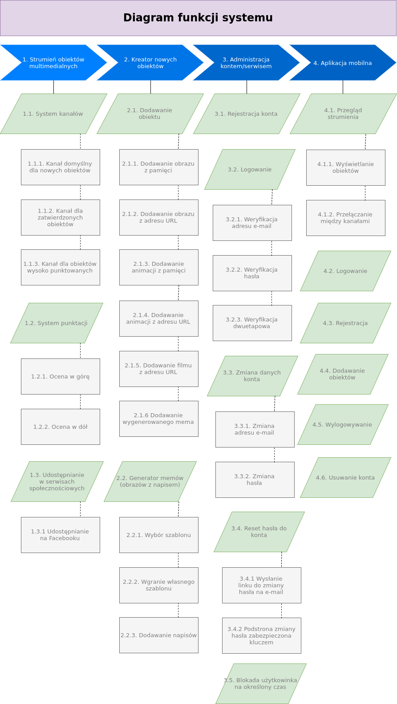